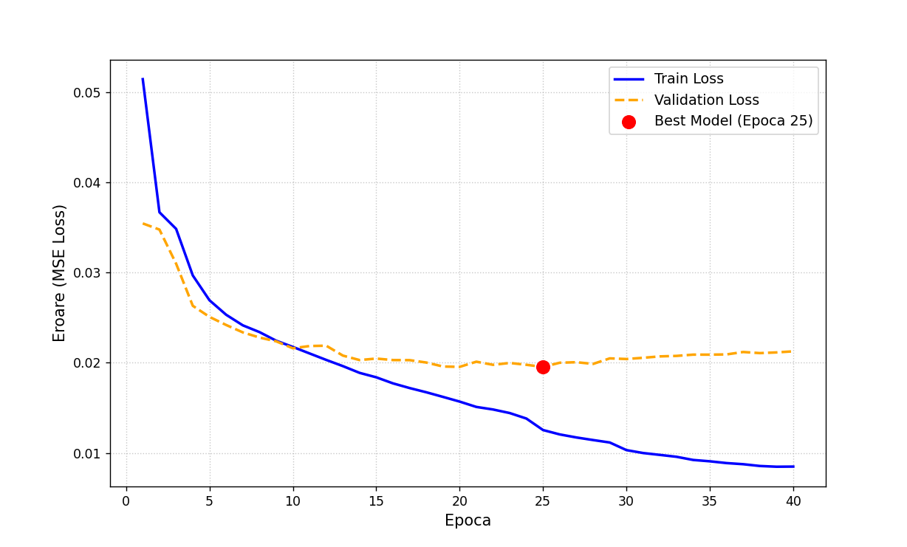
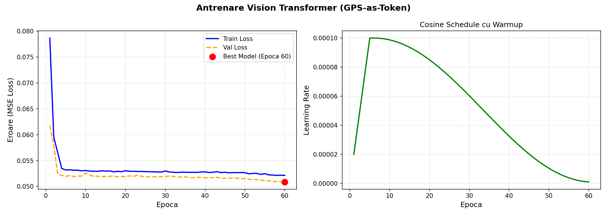
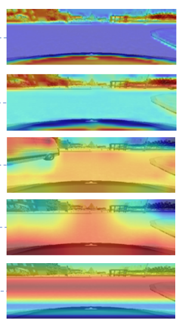
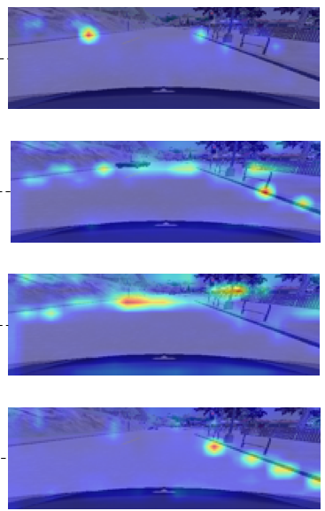

# Autonomous Driving in CARLA — CNN vs. Hybrid Vision Transformer

End-to-end conditional imitation learning for self-driving in the CARLA simulator. This project compares the standard NVIDIA-style conditional CNN against a **Hybrid Vision Transformer that injects GPS and traffic-light signals as dedicated tokens directly into the self-attention sequence** — the original architectural contribution of the work.

In a fixed 6-route benchmark across distinct weather conditions in Town01 with dense traffic, the Hybrid ViT completed **5 out of 6 routes (1 collision, 3,202 m driven)** while the CNN baseline completed only **1 out of 6 (3 collisions, 1,617 m driven)** — despite both models reaching a nearly identical validation loss of ~0.0195.

<!-- Replace with a 10–15 s clip of the ViT driving autonomously in Town01 -->
[](https://youtu.be/VcucVdwaAFg)

---

## Why this is interesting

Two questions drove the project:

1. Can a conditional imitation learning system trained only on simulator data drive reliably through dense urban traffic, multiple weather conditions, and signaled intersections?
2. Does *where* and *how* you inject high-level navigation signals into a vision backbone actually matter, or is the standard concatenation-after-feature-extraction approach good enough?

The answer to the second question turned out to be the most informative part of the project: two models with almost identical offline validation loss behave very differently once you put them behind the wheel. Behavioral evaluation, not val loss, is what separates a model that drives from a model that crashes.

## Results

Both models were trained on the same dataset (~19,800 images), evaluated on six fixed routes in CARLA Town01 with 30 NPC vehicles, and run under six distinct weather presets (clear day, overcast, light rain, heavy rain, fog, sunset). The throttle multiplier was unified across both models for a fair comparison.

| Metric | NVIDIA Conditional CNN | **Hybrid ViT (ours)** |
|---|---|---|
| Routes completed | 1 / 6 | **5 / 6** |
| Total collisions | 3 | **1** |
| Total distance driven | 1,617 m | **3,202 m** |
| Validation loss (best) | 0.01954 | 0.01951 |
| Best epoch | 25 / 40 | 65 / 80 |

The CNN tends to fail in two characteristic ways: hesitating at intersections under unfamiliar lighting, and oscillating laterally at higher speeds. The ViT generalizes more cleanly to the held-out weather conditions and reacts more decisively at intersections, which is consistent with the attention maps showing it locking onto distant lane geometry and traffic-light positions early in the sequence.

### Training curves

Both models converge cleanly, with training and validation loss tracking closely — the strongest indicator that the dataset is well-balanced and not over-augmented.

<p align="center">
  
  
</p>
<p align="center"><em>Up: NVIDIA Conditional CNN. Down: Hybrid ViT.</em></p>

## Original contribution — GPS and Traffic Light as Self-Attention Tokens

In classical Conditional Imitation Learning (Codevilla et al., 2018) and most CARLA baselines, the navigation command is fused with the visual features *after* the CNN has already produced a global representation. The visual encoder has no way to know, while it's looking at the image, that the agent is supposed to turn left at the next intersection.

This project does the opposite. The Hybrid ViT processes a sequence of **228 tokens**:

```
[CLS] [GPS] [TL] [patch_1] [patch_2] ... [patch_225]
```

- A **Conv Stem** (3 stride-2 conv layers, 3→48→96→128 channels) produces 225 patch tokens at a 9×25 spatial grid. The early conv layers extract local features (edges, lane markings, textures) before the transformer ever sees them — a design motivated by Xiao et al., *Early Convolutions Help Transformers See Better*.
- The **GPS command** (one-hot over 4 classes: lane-follow, left, right, straight) is embedded as its own token.
- The **traffic light state** (one-hot over 3 classes: green/none, red, yellow) is also embedded as its own token.
- These two condition tokens participate in self-attention **from the very first transformer layer**, alongside all 225 visual patches.

The hypothesis is that this lets the visual backbone modulate what it attends to as a function of the current command — for example, looking further down the left turn lane when GPS says LEFT, or focusing more sharply on a traffic light when TL says RED. The benchmark results support that hypothesis.

Architecture: 4 transformer blocks, 4 attention heads, 128-dim embeddings, AdamW with cosine warmup, MSE loss weighted to emphasize steering (×2). The full model has roughly the same parameter count as the CNN baseline.

## Architecture comparison

**NVIDIA Conditional CNN (baseline)**
```
RGB image (200×66, YUV) ─►  5 conv layers (NVIDIA PilotNet)  ─►  1152 features   ─┐
GPS command (one-hot, 4 classes)  ─►  Linear(4 → 16)                              ├─►  MLP  ─►  [steer, throttle, brake]
TL state (one-hot, 3 classes)     ─►  Linear(3 → 16)                             ─┘
```
Fusion happens *after* feature extraction. The CNN never sees the command while extracting features.

**Hybrid ViT (this work)**
```
RGB image (200×66, YUV) ─►  Conv Stem (3 layers, 3→48→96→128 ch)  ─►  225 patch tokens (128-dim)
GPS command (one-hot, 4 classes) ─►  Linear → ReLU → Linear        ─►  1 GPS token
TL state (one-hot, 3 classes)    ─►  Linear → ReLU → Linear        ─►  1 TL token
                                                                       │
[CLS] + [GPS] + [TL] + 225 patches  ─►  4× Transformer blocks  ─►  CLS head  ─►  [steer, throttle, brake]
```
Condition tokens participate in attention from layer 1.

### Visualizations — what each model "looks at"

The most informative way to compare the two architectures is to look at where each one focuses while driving. The CNN heatmaps show the regions of the input that activate the convolutional layers most strongly; the ViT attention maps show how the network distributes attention across the 225 visual patches.

<p align="center">
  
  
</p>
<p align="center"><em>Left: CNN convolutional activations. Right: ViT self-attention map. The ViT consistently distributes attention along lane geometry and traffic-light positions, while the CNN activations are more diffuse.</em></p>

## System highlights

This is not just a model — it's a closed-loop driving system. Several engineering decisions ended up being as important as the architecture itself:

- **Traffic light detection with a dual fallback.** The primary signal comes from CARLA's API; a 30-meter manual fallback uses dot-product direction checks and `lane_id` filtering to handle edge cases where the API misses the light affecting the current lane.
- **Adaptive speed targets per navigation command.** Lane-follow targets 30 km/h; right turn 13 km/h; left turn 15 km/h; straight crossing 20 km/h. Stops the car from taking turns at lane-follow speed.
- **Three-zone braking logic.** Smooth braking at distance, firmer at mid-range, hard stop at close range — much less jerky than a single-threshold brake.
- **Steering rate limiter and EMA smoothing.** Caps `Δsteer` per frame and runs the prediction through an exponential moving average; eliminates the high-frequency oscillation that plagued early runs.
- **Speed-dependent steering dampening.** Steering authority scales down as speed increases (free below 15 km/h, scaled to 0.55× by 30 km/h), so the car turns crisply at low speed and stays stable at high speed.
- **Live visualization.** A pygame HUD shows predictions, telemetry, and either CNN heatmaps (5 conv layers, switchable) or ViT attention maps (4 layers, switchable) over the input frame, with EMA smoothing on the attention overlay.
- **6-route benchmark harness.** Fixed spawn/destination pairs, fixed NPC seed, fixed weather rotation. Both models are evaluated under identical conditions.

## Engineering lessons (what I'd tell another student starting this project)

These were the non-obvious things, often learned the hard way:

- **Horizontal flip augmentation looks correct mathematically but is visually wrong.** Negating the steering and swapping LEFT↔RIGHT GPS commands is the mathematically consistent thing to do — but the flipped image shows the road on the wrong side, teaching the model to drive on the counter-lane. I removed flip entirely. The training/validation loss curves overlapped much more cleanly afterward.
- **GPS command must be one-hot, never scalar.** A scalar or ordinal encoding (e.g., 0/1/2/3) implicitly tells the model that LEFT is "closer to" STRAIGHT than to RIGHT, which is nonsense for categorical commands. Switching to `F.one_hot(...)` and `Linear(4, …)` fixed a class of subtle directional errors at intersections.
- **Data quality beats data quantity.** Mixing recovery frames (deliberately bad starts followed by corrections) with normal autopilot frames caused oscillation and random stops at inference time. Strict collection rules — dominant clean frames, only carefully limited recovery — gave overlapping train/val curves from the first epochs onward, which is the strongest signal of clean data.
- **agent.done() is unreliable when the model, not the BasicAgent, is driving.** A simple distance-to-destination threshold (< 20 m) is a much more honest route-completion criterion.
- **Verify visual correctness independently from mathematical correctness** for every augmentation and transformation. They're not the same thing.

## Tech stack

Python 3.8 · PyTorch · CARLA 0.9.12 · NumPy · Pillow · OpenCV · Pygame · Matplotlib

## Project structure

```
.
├── collect_autopilot.py    # Data collection in CARLA (autopilot with manual override)
├── collect_manual.py       # Manual data collection
├── process_data.py         # Smoothing, balancing, cropping (no horizontal flip)
├── train.py                # Training loop — NVIDIA Conditional CNN
├── train_vit.py            # Training loop — Hybrid ViT
├── drive_model.py          # Closed-loop driving with the CNN
├── drive_model_vit.py      # Closed-loop driving with the ViT
├── benchmark.py            # 6-route fixed benchmark harness
├── feature_map.py          # Visualization of CNN conv-layer activations
├── benchmark_results.csv   # Per-route metrics, both models
└── experiment_log.csv      # Training-run log
```

## Quick start

```bash
conda activate carla-gpu
cd path/to/PythonAPI/examples

# 1. Collect driving data
python collect_autopilot.py

# 2. Process the dataset (smoothing, balancing, cropping)
python process_data.py

# 3. Train the model (pick one)
python train.py        # NVIDIA Conditional CNN
python train_vit.py    # Hybrid ViT

# 4. Drive autonomously
python drive_model.py        # CNN
python drive_model_vit.py    # ViT

# 5. Run the benchmark
python benchmark.py --model cnn
python benchmark.py --model vit
```

## About

This project is my Bachelor's thesis at the *Universitatea Transilvania din Brașov*, IESC department (2026). The goal was to build a complete autonomous driving system end-to-end — from data collection, through dataset engineering and model design, to a benchmark harness and closed-loop deployment — and to propose and validate an architectural change that is not just a reimplementation of existing work.


## References

- Bojarski et al., *End-to-End Learning for Self-Driving Cars*, NVIDIA, 2016.
- Codevilla et al., *End-to-End Driving via Conditional Imitation Learning*, ICRA, 2018.
- Dosovitskiy et al., *An Image is Worth 16×16 Words* (ViT), ICLR, 2021.
- Vaswani et al., *Attention Is All You Need*, NeurIPS, 2017.
- Xiao et al., *Early Convolutions Help Transformers See Better*, NeurIPS, 2021.
- Dosovitskiy et al., *CARLA: An Open Urban Driving Simulator*, CoRL, 2017.
